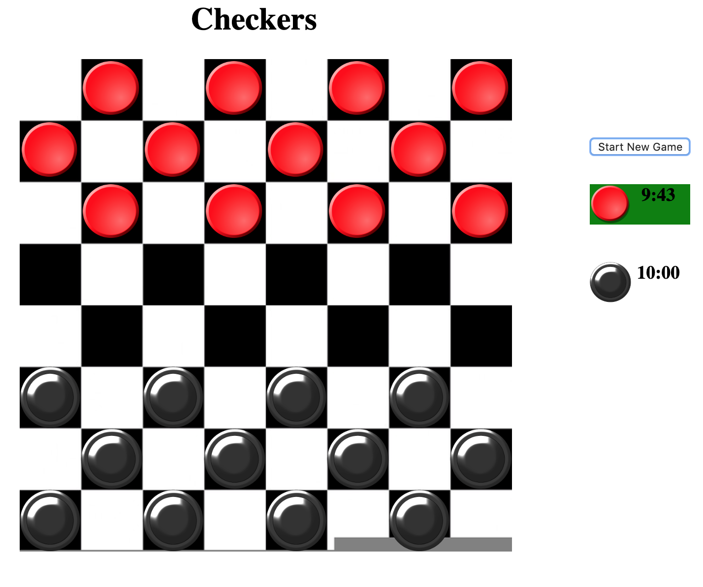

# Checkers
### By Alban Xhaferllari

## About Checkers
Checkers is played by two players. Each player begins the game with 12 colored discs. (Typically, one set of pieces is black and the other red.) Each player places his or her pieces on the 12 dark squares closest to him or her. Black moves first. Players then alternate moves.

The board consists of 64 squares, alternating between 32 dark and 32 light squares. It is positioned so that each player has a light square on the right side corner closest to him or her.

A player wins the game when the opponent cannot make a move. In most cases, this is because all of the opponent's pieces have been captured, but it could also be because all of his pieces are blocked in.

## Rules
- Moves are allowed only on the dark squares, so pieces always move diagonally. Single pieces are always limited to forward moves (toward the opponent).
- A piece making a non-capturing move (not involving a jump) may move only one square.
- A piece making a capturing move (a jump) leaps over one of the opponent's pieces, landing in a straight diagonal line on the other side. Only one piece may be captured in a single jump; however, multiple jumps are allowed during a single turn.
When a piece is captured, it is removed from the board.
- If a player is able to make a capture, there is no option; the jump must be made. If more than one capture is available, the player is free to choose whichever he or she prefers.
- When a piece reaches the furthest row from the player who controls that piece, it is crowned and becomes a king. One of the pieces which had been captured is placed on top of the king so that it is twice as high as a single piece.
- Kings are limited to moving diagonally but may move both forward and backward. (Remember that single pieces, i.e. non-kings, are always limited to forward moves.)
- Kings may combine jumps in several directions, forward and backward, on the same turn. Single pieces may shift direction diagonally during a multiple capture turn, but must always jump forward (toward the opponent).

## About Checkers by Alban Xhaferllari
All the rules above apply, with a few additional:
- If a player can not move, the opposing player is said to 'win by default'
- There is a time limit of 10 minutes for total play time. Counter times down the as a player takes time to think/move.
- First player to time out (timer goes to 0), loses the game.

Screenshot of gameboard with timer

#### Some mroe info for playing virtual checkers
For now, players must play on the same machine, sharing the mouse when their turn is over. Clicking on a piece will highlight all potential moves it can make. Then clicking on the highlighted spot on the board will move the piece there. The timer was an add one to promote faster gameplay, this can be removed or changed to a shorter timer that resets everytime a players turn starts.

## Short overview of the code
- Written in HTML, CSS, Javascript
- Board represented by a section, and each boardspot is an image, src toggeled between a piece image source or an empty string
- The board is represented by an array of length 64, one for each spot. Index 0 is top left (north west referred to in code comments), and index 63 is bottom right.
- A checkers class produces all the checker piece objects and they are placed on the board.
- Event listeners on the board will respond to a player selecting a piece, then to a player selecting a highlighted square for the piece to jump to. This event updates the board with the new locations of checker object pieces.
- The timer is set to update every second in a setInterval function. Because of the high frequency of renders the timer has, the code has its own render function specifically for the timer.
- Upon a win, the title of the webpage will display the winning player.

Game link: https://xhaferllari11.github.io/Checkers/

